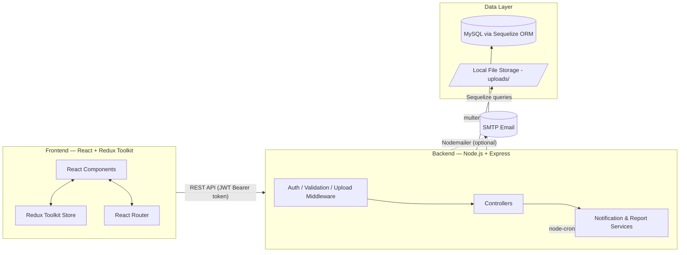
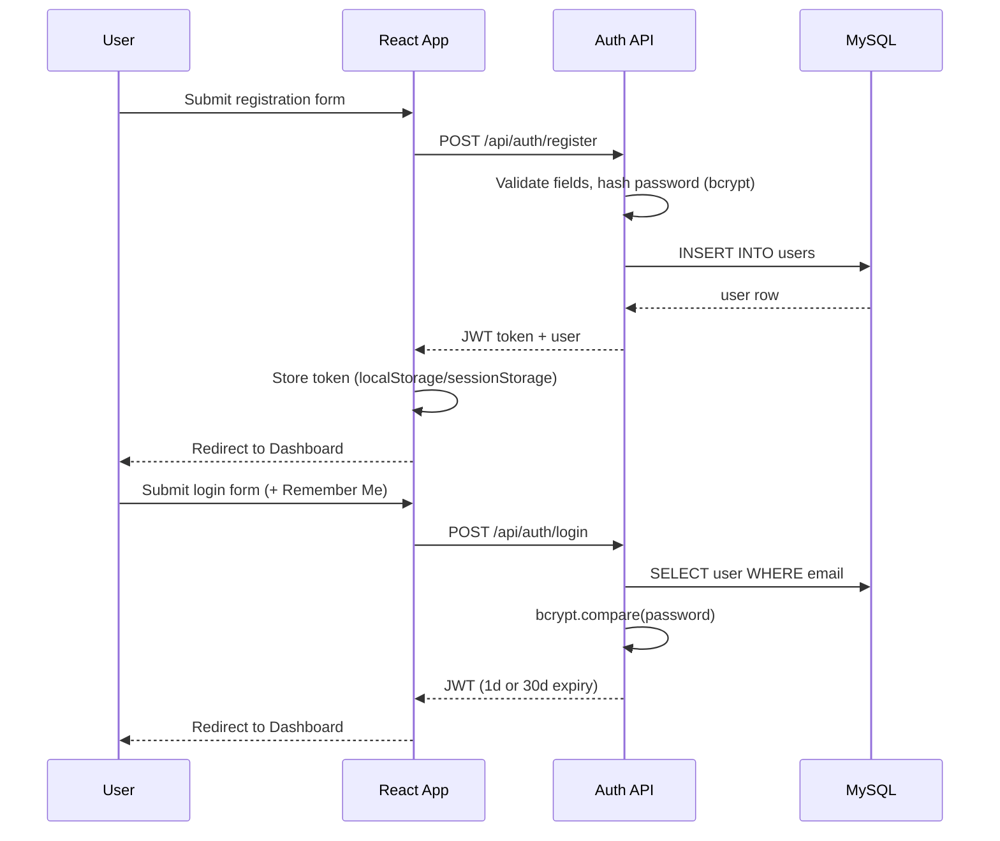
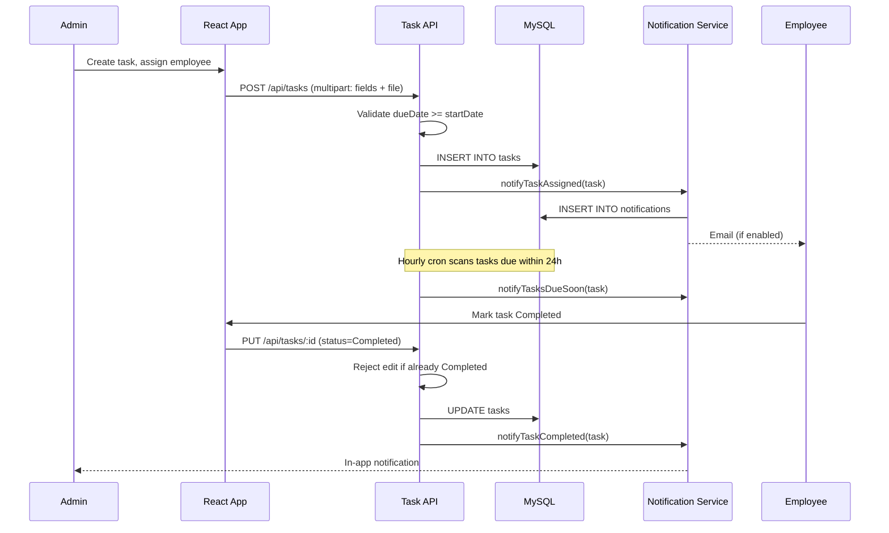
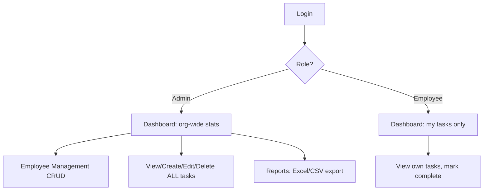

# Architecture & Flow Diagrams

## 1. System Architecture

```mermaid
flowchart LR
    subgraph Client["Frontend — React + Redux Toolkit"]
        UI[React Components]
        RTK[Redux Toolkit Store]
        RR[React Router]
        UI <--> RTK
        UI <--> RR
    end

    subgraph Server["Backend — Node.js + Express"]
        MW[Auth / Validation / Upload Middleware]
        CTRL[Controllers]
        SVC[Notification & Report Services]
        MW --> CTRL --> SVC
    end

    subgraph Data["Data Layer"]
        DB[(MySQL via Sequelize ORM)]
        FS[/Local File Storage - uploads//]
    end

    Client -- "REST API (JWT Bearer token)" --> Server
    Server -- "Sequelize queries" --> DB
    Server -- "multer file writes" --> FS
    Server -. "Nodemailer (optional)" .-> Email[(SMTP Email)]
    Server -. "node-cron hourly job" .-> SVC
```

## 2. Authentication Flow

```mermaid
sequenceDiagram
    participant U as User
    participant F as React App
    participant A as Auth API
    participant DB as MySQL

    U->>F: Submit registration form
    F->>A: POST /api/auth/register
    A->>A: Validate fields, hash password (bcrypt)
    A->>DB: INSERT INTO users
    DB-->>A: user row
    A-->>F: JWT token + user
    F->>F: Store token (localStorage/sessionStorage)
    F-->>U: Redirect to Dashboard

    U->>F: Submit login form (+ Remember Me)
    F->>A: POST /api/auth/login
    A->>DB: SELECT user WHERE email
    A->>A: bcrypt.compare(password)
    A-->>F: JWT (1d or 30d expiry)
    F-->>U: Redirect to Dashboard
```

## 3. Task Lifecycle & Notifications

```mermaid
sequenceDiagram
    participant Admin
    participant F as React App
    participant T as Task API
    participant DB as MySQL
    participant N as Notification Service

    Admin->>F: Create task, assign employee
    F->>T: POST /api/tasks (multipart: fields + file)
    T->>T: Validate dueDate >= startDate
    T->>DB: INSERT INTO tasks
    T->>N: notifyTaskAssigned(task)
    N->>DB: INSERT INTO notifications
    N-->>Employee: Email (if enabled)

    Note over T,DB: Hourly cron scans tasks due within 24h
    T->>N: notifyTasksDueSoon(task)

    Employee->>F: Mark task Completed
    F->>T: PUT /api/tasks/:id (status=Completed)
    T->>T: Reject edit if already Completed
    T->>DB: UPDATE tasks
    T->>N: notifyTaskCompleted(task)
    N-->>Admin: In-app notification
```

## 4. Role-Based Access Summary

```mermaid
flowchart TD
    Login[Login] --> Role{Role?}
    Role -->|Admin| AdminDash[Dashboard: org-wide stats]
    Role -->|Employee| EmpDash[Dashboard: my tasks only]
    AdminDash --> Emp[Employee Management CRUD]
    AdminDash --> AllTasks[View/Create/Edit/Delete ALL tasks]
    AdminDash --> Reports[Reports: Excel/CSV export]
    EmpDash --> OwnTasks[View own tasks, mark complete]
```
